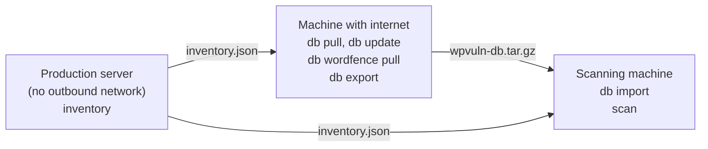

# wordpress-vulnerable-scanner

A command-line tool, written in Rust, that finds known vulnerabilities in the
plugins, themes and core of a WordPress site. It reads what is installed
straight from the files, looks the versions up in public vulnerability data
(WPVulnerability, and optionally Wordfence Intelligence), and can do all of the
checking offline. It is meant for people who audit WordPress sites, especially
on servers that cannot reach the internet.

One rule runs through the whole tool: **it never reports "clean" for something
it did not actually check.** A plugin that no database knows about is reported
as *not checked*, not as safe.

## Contents

- [Why offline](#why-offline)
- [Features](#features)
- [Install](#install)
- [Quick start](#quick-start)
- [The offline workflow](#the-offline-workflow)
- [Input forms](#input-forms)
- [Understanding the result](#understanding-the-result)
- [CI and DefectDojo](#ci-and-defectdojo)
- [Comparing sources](#comparing-sources)
- [Honest limits](#honest-limits)
- [Data sources and licensing](#data-sources-and-licensing)
- [Development](#development)
- [Complete example](#complete-example)
- [Contributing and licence](#contributing-and-licence)

## Why offline

Production servers are often locked down: outbound traffic to security
services is blocked. So the work is split. Read the installed versions on the
server, where no network is needed. Fetch vulnerability data on a machine that
has internet. Carry the data over and scan anywhere, with no network at all.

## Features

- **Inventory** of installed plugins, themes, must-use plugins, drop-ins and
  core, read from plugin headers the way WordPress does (no PHP, no WP-CLI
  needed). Works on a WordPress root, `wp-content`, a plugins folder, or a
  `.tar`/`.tar.gz`/`.zip` of one, without extracting it.
- **Aliases** from an installed folder name to the real wordpress.org slug
  (`my-plugin-pro2` -> `my-plugin-pro`), with suggestions checked against the
  data.
- **Local database** of WPVulnerability records: `db pull`, `db update` (with
  a change log), `db status`, `db verify` (checksums), `db export` /
  `db import` for moving it between machines.
- **Wordfence Intelligence** as a second source, from wpprobe's keyless export
  on GitHub or from the official API with a free key.
- **Scanning** against one source or both, with an explicit state for every
  component, and human, JSON, CSV, Markdown and DefectDojo output.
- Optional WP-CLI enrichment of the inventory (active or inactive status) on
  servers where WP-CLI is installed.

## Install

### Pre-built binaries

Download from [GitHub Releases](https://github.com/robdotec/wordpress-vulnerable-scanner/releases):

| Platform | Architecture | File |
|----------|--------------|------|
| Linux | x86_64 | `wordpress-vulnerable-scanner-linux-x86_64.tar.gz` |
| Linux | x86_64 (static) | `wordpress-vulnerable-scanner-linux-x86_64-musl.tar.gz` |
| Linux | ARM64 | `wordpress-vulnerable-scanner-linux-aarch64.tar.gz` |
| macOS | Intel | `wordpress-vulnerable-scanner-macos-x86_64.tar.gz` |
| macOS | Apple Silicon | `wordpress-vulnerable-scanner-macos-aarch64.tar.gz` |
| Windows | x86_64 | `wordpress-vulnerable-scanner-windows-x86_64.zip` |

### Cargo

```bash
cargo install wordpress-vulnerable-scanner
```

### Build from source

Requirements: Rust 1.91.1 or newer (the `rust-version` in `Cargo.toml`), a C
linker (`build-essential` on Debian/Ubuntu, `gcc` on most other distributions),
and git. Install Rust with [rustup](https://rustup.rs) or your distribution's
package.

```bash
git clone https://github.com/robdotec/wordpress-vulnerable-scanner
cd wordpress-vulnerable-scanner
cargo build --release
./target/release/wordpress-vulnerable-scanner --version
```

The binary is `target/release/wordpress-vulnerable-scanner`. To put it on your
`PATH` (in `~/.cargo/bin`), run `cargo install --path .`.

The name is long; a shell alias such as
`alias wvs=wordpress-vulnerable-scanner` helps. The examples below use the full
name.

## Quick start

Check one plugin version against the live WPVulnerability API:

```bash
wordpress-vulnerable-scanner scan -p akismet:5.0
```

```text
WordPress Vulnerable Scanner v1.0.0
by Robert F. Ecker <robert@robdotec.com>

MEDIUM (1)
┌───────────┬─────────┬──────────────────────────────────────────────────────────┬─────────┐
│ Component ┆ Version ┆ Vulnerability                                            ┆ Fixed   │
╞═══════════╪═════════╪══════════════════════════════════════════════════════════╪═════════╡
│ akismet   ┆ 5.0     ┆ CVE-2026-10001: Akismet < 5.0.2 - Stored Cross-Site S... ┆ >=5.0.2 │
└───────────┴─────────┴──────────────────────────────────────────────────────────┴─────────┘

Summary: 0 Critical, 0 High, 1 Medium, 0 Low; 1 components: 1 vulnerable, 0 clean, 0 not checked
```

All sample output in this README comes from a demo site and **made-up demo
records** served through a local mirror (`WPVULN_API`), so it is reproducible.
`CVE-2026-1000x` are not real CVEs.

`scan` is the default command, so the same check works without the word
`scan`; this README always writes it.

A version with no known vulnerability prints:

```text
No vulnerabilities found.
```

That means: the data source knows this plugin, and none of its recorded
vulnerabilities affects this version. It does **not** mean the plugin is safe;
only published vulnerabilities are known. A plugin the source does not know
is never reported that way:

```bash
wordpress-vulnerable-scanner scan -p my-custom-plugin:1.0.0
```

```text
...
No vulnerabilities found in the 0 components that could be checked.

NOT CHECKED (1): not known to be safe, review by hand
  not tracked (1): the data source has no entry (common for premium and custom code)
    my-custom-plugin 1.0.0
...
```

## The offline workflow



The scanning machine can be the machine with internet; the point is that the
server only reads files and the scan needs no network.

### 1. Inventory, on the server

```bash
wordpress-vulnerable-scanner inventory /var/www/html -o inventory.json
```

Give it a WordPress root, a `wp-content` folder, a plugins folder, or an
archive of one (`tar czf site.tar.gz site` and then `inventory site.tar.gz`).
It reads only the first 8 KiB of each candidate file, like WordPress does, and
never runs PHP. A short summary goes to stderr:

```text
Inventory site (wordpress layout): 5 plugins, 1 theme, core 6.6.2
```

`--format list` prints `slug:version` lines instead of JSON (`--type theme`
or `--type core` for the other lists):

```text
akismet:5.0
elementor:3.20.0
my-custom-plugin:1.0.0
my-plugin-pro2:2.1.0
woocommerce:10.3.7
```

Anything it could not resolve (a folder without a plugin header, a missing
version, archives left in the plugins folder) is listed as a warning that says
what it means. Where WP-CLI is installed, `--with-wp-cli` adds each
component's status from the WordPress database.

### 2. Aliases

Vulnerability data is keyed by wordpress.org slug, but folders are sometimes
renamed (`my-plugin-pro2`). `aliases suggest` proposes mappings and prints them
as TOML for you to review; it never changes any file:

```bash
wordpress-vulnerable-scanner aliases suggest inventory.json --online > aliases-suggested.toml
```

```text
...
# my-plugin-pro2: My Plugin Pro 2.1.0 (my-plugin-pro2/my-plugin-pro.php)
#   own slug: not tracked
#   my-plugin-pro2 = "my-plugin-pro": tracked, 1 record; dropped trailing digits; Text Domain header
#   my-plugin-pro2 = "my-plugin": not tracked; dropped trailing digits, dropped "-pro"
"my-plugin-pro2" = "my-plugin-pro"
Suggestions for 2 components: 1 confirmed, 0 to review, 1 without candidates
```

Only candidates the data confirms become active lines. `--online` asks the
API; `--db DIR` checks a local database instead. Copy the lines you agree with
into `aliases.toml`:

```toml
[plugin]
"my-plugin-pro2" = "my-plugin-pro"
```

A plugin that ships with a theme can point at it with
`"my-theme-addons" = { theme = "my-theme" }`.

### 3. Build and update the database, on a machine with internet

```bash
wordpress-vulnerable-scanner db pull --db wpvuln-db --inventory inventory.json --aliases aliases.toml
```

```text
...
  [1/7] ✓ core 6.6.2             tracked, no known vulnerabilities
  [2/7] ✓ elementor         2 records
  [3/7] ? my-custom-plugin  not tracked by WPVulnerability (not checked)
  [4/7] ✓ akismet           1 record
  [5/7] ✓ my-plugin-pro     1 record
  [6/7] ✓ woocommerce       1 record
  [7/7] ✓ theme twentytwentyfour  tracked, no known vulnerabilities

Done in 527ms: 6 saved (5 records), 1 not tracked
...
```

Later, re-check what is stale and see what changed (conditional requests, so
unchanged records cost almost nothing):

```bash
wordpress-vulnerable-scanner db update --db wpvuln-db
wordpress-vulnerable-scanner db status --db wpvuln-db
wordpress-vulnerable-scanner db verify --db wpvuln-db --inventory inventory.json --aliases aliases.toml
```

`db update` re-checks records older than `--max-age` hours (default 24;
untracked ones after `--untracked-max-age`, default 168) and appends changes to
`wpvuln-db/changes/<date>.json`. `db verify` checks every record against the
sha256 recorded at download and that the inventory is fully covered:

```text
Verifying wpvuln-db
  7 record files checked
  1 untracked (not a problem: WPVulnerability has no entry for them, so they are not checked)
  7 lookups needed by inventory.json, 0 missing

OK: every record matches what was downloaded.
```

### 4. Optional: Wordfence as a second source

```bash
wordpress-vulnerable-scanner db wordfence pull --db wpvuln-db
```

```text
Pulling Wordfence data from GitHub (no key set; WORDFENCE_API_KEY or --api-key selects the official API)
Saved in 163.7s: 43949 records, 17543 slugs, 24.2 MB (wpprobe format: records with a CVE only)
...
```

(This one is a real run against the real file.) Without a key the tool
downloads wpprobe's export of Wordfence data from GitHub (records with a CVE
only). A second pull is cheap when nothing changed: the server answers "not
modified". With a free Wordfence Intelligence key
it uses the official feed instead (larger, includes records without a CVE):

```bash
export WORDFENCE_API_KEY=...   # wordfence.com > Account > Integrations
wordpress-vulnerable-scanner db wordfence pull --db wpvuln-db --from api
```

The API allows about one full download per 30 minutes per key; a second
`--from api` pull within that time is skipped unless you add `--force`. The
feed is stored in `wpvuln-db/wordfence/` together with `wordfence.NOTICE.txt`
(see [Data sources and licensing](#data-sources-and-licensing)). A feed file
obtained some other way can be added with
`db wordfence import <file> --db wpvuln-db`.

### 5. Move the database

```bash
wordpress-vulnerable-scanner db export --db wpvuln-db -o wpvuln-db.tar.gz
# copy the file over, then on the scanning machine:
wordpress-vulnerable-scanner db import wpvuln-db.tar.gz --db wpvuln-db
```

```text
Imported 12 files into wpvuln-db: every file matched the manifest and `db verify` passed
The previous database was moved to ./wpvuln-db.bak-2026-10-07T130740Z
```

Export refuses a database that fails `db verify`. Import unpacks into a
temporary folder, rejects unsafe paths and anything not listed in the
manifest, checks every sha256, runs `db verify`, and only then replaces the
target, keeping the previous one as a backup.

### 6. Scan offline

```bash
# WPVulnerability only
wordpress-vulnerable-scanner scan --db wpvuln-db --inventory inventory.json --aliases aliases.toml

# Wordfence only (no --db: no network at all)
wordpress-vulnerable-scanner scan --wordfence wpvuln-db/wordfence/wordfence.json --inventory inventory.json --aliases aliases.toml

# Both sources combined (`auto` = <db>/wordfence/wordfence.json)
wordpress-vulnerable-scanner scan --db wpvuln-db --wordfence auto --inventory inventory.json --aliases aliases.toml
```

Without `--db` and `--wordfence`, `scan` asks the live WPVulnerability API.

## Input forms

| Input | Example | Notes |
|---|---|---|
| `-p, --plugins` | `-p akismet:5.0,elementor:3.20.0` | comma-separated `slug:version` |
| `--plugins-file` | `--plugins-file plugins.txt` | one per line: `slug:version`, `slug version` or `slug,version`; `#` comments; reads `wp plugin list --fields=name,version --format=csv` |
| `-t, --themes` | `-t twentytwentyfour:1.2` | like `-p` |
| `--themes-file` | `--themes-file themes.txt` | like `--plugins-file` |
| `-c, --core` | `-c 6.6.2` | WordPress version |
| `--inventory` | `--inventory inventory.json` | an inventory file, or a folder or archive to inventory on the spot; with `--aliases` |
| `-m, --manifest` | `-m manifest.json` | JSON from the upstream `wordpress-audit` tool |
| URL | `wordpress-vulnerable-scanner https://example.com` | scans a live site's public pages to guess versions |

The list inputs can be combined. A URL cannot: when a URL is given, `-p`, `-t`,
`-c` and the other inputs are silently ignored.

## Understanding the result

### Component states

Every component ends in exactly one state:

| State | Checked? | Meaning |
|---|---|---|
| `vulnerable` | yes | the installed version is inside an affected range |
| `alias_match` | yes | the same, found through an alias: confirm, premium versions may differ |
| `clean` | yes | known to the source; no affected range contains the installed version |
| `untracked` | **no** | no source has an entry (common for premium and custom code) |
| `not_in_db` | **no** | never pulled into the local database |
| `unknown_version` | **no** | no version could be read |
| `failed` | **no** | the lookup failed (network error, damaged record) |

With several sources, a component is "not checked" only when no source had
data for it; the report says which source lacked it.

### Output formats

| `-o` | What you get |
|---|---|
| `human` (default) | tables by severity, alias matches, a NOT CHECKED list, a summary |
| `json` | everything, including `state`, per-source `coverage`, and per finding `sources`, `ranges`, CVEs, CVSS, `fixed_in` |
| `csv` | one row per finding, plus one row per component without findings |
| `markdown` | a report for people |
| `defectdojo` | DefectDojo "Generic Findings Import" JSON |
| `none` | nothing; use the exit code |

`--severity high` hides lower findings from the human, CSV and Markdown
output; the summary still counts everything. Human output from the combined
scan above:

```text
...
CRITICAL (1)
┌───────────────────────────────────┬─────────┬──────────────────────────────────────────────────────────┬─────────┐
│ Component                         ┆ Version ┆ Vulnerability                                            ┆ Fixed   │
╞═══════════════════════════════════╪═════════╪══════════════════════════════════════════════════════════╪═════════╡
│ my-plugin-pro2 (as my-plugin-pro) ┆ 2.1.0   ┆ CVE-2026-10004: My Plugin Pro < 2.2.0 - Unauthenticat... ┆ >=2.2.0 │
└───────────────────────────────────┴─────────┴──────────────────────────────────────────────────────────┴─────────┘
...
Found through an alias, confirm before acting
  my-plugin-pro2 (as my-plugin-pro) 2.1.0: premium editions may number versions differently

NOT CHECKED (1): not known to be safe, review by hand
  not tracked (1): the data source has no entry (common for premium and custom code)
    my-custom-plugin 1.0.0

Summary: 1 Critical, 1 High, 3 Medium, 0 Low; 7 components: 4 vulnerable, 2 clean, 1 not checked
Sources: WPVulnerability had no data for 1, Wordfence had no data for 3 (a component counts as not checked only when no source had data)
...
Vulnerability data from Wordfence Intelligence, Copyright (c) Defiant, Inc. (https://www.wordfence.com/wordfence-intelligence-terms-and-conditions/). CVE records Copyright (c) The MITRE Corporation.
```

The same scan as JSON (trimmed):

```json
{
  "url": null,
  "scan_date": "2026-10-07T13:04:18Z",
  "components": [
...
    {
      "component_type": "plugin",
      "slug": "akismet",
      "version": "5.0",
      "vulnerabilities": [
        {
          "id": "CVE-2026-10001",
          "title": "Akismet < 5.0.2 - Stored Cross-Site Scripting",
          "severity": "medium",
          "cvss_score": 6.1,
...
          "fixed_in": "5.0.2",
...
          "sources": [
            "wpvulnerability"
          ]
        }
      ],
      "max_severity": "medium",
      "state": "vulnerable",
      "matched_via": "slug",
...
```

### Exit codes

| Code | Meaning |
|---|---|
| 0 | no vulnerabilities found |
| 1 | vulnerabilities found |
| 2 | at least one critical vulnerability found |
| 10 | error (for example no input, a bad flag, an unreadable database or feed) |

**1 and 2 are results, not failures of the tool.** (`db pull` and `db update`
exit 1 when some records could not be downloaded.) For CI:

- `--fail-on <none|low|medium|high|critical>` lets only findings at or above
  that severity make the exit code non-zero (`none`: never);
- `--fail-on-unchecked` exits 1 when nothing was found but some component
  could not be checked.

### jq cookbook

All of these run against `report.json` from
`scan ... -o json > report.json`:

```bash
# The summary, including per-state counts
jq '.summary' report.json

# Only what is vulnerable
jq -r '.components[] | select(.vulnerabilities | length > 0) | "\(.installed_as // .slug) \(.version) \(.state): \([.vulnerabilities[].id] | join(", "))"' report.json

# What was not checked, and why
jq -r '.components[] | select(.state as $s | ["untracked","not_in_db","unknown_version","failed"] | index($s)) | "\(.slug) \(.version // "-") \(.state): \(.note)"' report.json

# Findings per severity
jq -r '[.components[].vulnerabilities[].severity] | group_by(.) | map("\(.[0]): \(length)") | .[]' report.json

# Which source reported each finding
jq -r '.components[].vulnerabilities[] | "\(.id) \(.sources | join("+"))"' report.json

# What to update to
jq -r '.components[] | .slug as $s | .vulnerabilities[] | select(.fixed_in) | "\($s): update to \(.fixed_in) or later (\(.id))"' report.json
```

```text
akismet 5.0 vulnerable: CVE-2026-10001
elementor 3.20.0 vulnerable: CVE-2026-10003
my-plugin-pro2 2.1.0 alias_match: CVE-2026-10004, CVE-2026-10005
woocommerce 10.3.7 vulnerable: CVE-2026-10002
```

## CI and DefectDojo

A job that fails only on high or critical findings and keeps a file for
DefectDojo:

```bash
set +e
wordpress-vulnerable-scanner scan --db wpvuln-db --inventory inventory.json \
  --aliases aliases.toml --fail-on high -o defectdojo > findings.json
code=$?
set -e
case "$code" in
  0) echo "No high or critical findings." ;;
  1|2) echo "High or critical findings (exit $code), see findings.json."; exit 1 ;;
  *) echo "Scanner error (exit $code)."; exit "$code" ;;
esac
```

Import `findings.json` in DefectDojo as the scan type **Generic Findings
Import**. Only fields DefectDojo documents are used. `unique_id_from_tool` is
stable across runs, so re-imports deduplicate. Components that were not
checked become `Info` findings tagged `not-checked`, and findings found through
an alias are tagged `alias-match`.

## Comparing sources

Run the same inventory three ways and compare:

```bash
wordpress-vulnerable-scanner scan --db wpvuln-db --inventory inventory.json --aliases aliases.toml -o json > wpvulnerability.json
wordpress-vulnerable-scanner scan --wordfence wpvuln-db/wordfence/wordfence.json --inventory inventory.json --aliases aliases.toml -o json > wordfence.json
wordpress-vulnerable-scanner scan --db wpvuln-db --wordfence auto --inventory inventory.json --aliases aliases.toml -o json > both.json
```

In the combined report each finding lists the sources that reported it, and
findings with the same CVE are merged. A finding is reported if **any** source
says the installed version is affected.

The sources model ranges differently. Wordfence stores one range per
maintenance branch; WPVulnerability stores one range. When a fix is backported
(say a WooCommerce flaw fixed in `10.4.3` and backported to `10.3.7`),
WPVulnerability's single range (`<= 10.4.2`) marks `10.3.7` as affected, while
Wordfence's branch ranges (`10.3.0 - 10.3.6`, `10.4.0 - 10.4.2`, ...) mark it
clean. The combined scan does **not** resolve such disagreements yet; it
reports the finding with `"sources": ["wpvulnerability"]`. To find candidates,
look for findings one source reported for a component the other source tracks:

```bash
jq -r '.components[] | select(.coverage.wordfence == "tracked") | (.installed_as // .slug) as $s | .version as $v | .vulnerabilities[] | select(.sources | index("wordfence") | not) | "\($s) \($v): \(.id) only from \(.sources | join("+"))"' both.json
```

```text
my-plugin-pro2 2.1.0: CVE-2026-10004 only from wpvulnerability
woocommerce 10.3.7: CVE-2026-10002 only from wpvulnerability
```

Then check the records: Wordfence may simply have no record for that CVE, or
it may consider the version patched.

## Honest limits

- **Untracked means not checked.** Premium, marketplace and custom plugins are
  usually in no public database. They get no verdict and need a manual or code
  review.
- **Folder name is not always the slug.** Aliases fix that, but a wrong alias
  gives a wrong answer, and premium editions do not always share the free
  version's numbering.
- **Versions come from plugin headers**, not from running PHP. A modified or
  backdated header is not detected.
- **Only known, published vulnerabilities are found.** No zero-days, no code
  analysis. For source code scanning use a SAST tool such as Semgrep alongside
  this one.
- **Data is as fresh as your last `db pull` or `db update`.** `db status`
  shows the age of the oldest check and of the Wordfence feed, and warns when
  the feed is older than 7 days.
- **The data comes from third parties**, some volunteer-run. Nothing is
  guaranteed: a missing record is not proof of safety.

## Data sources and licensing

- **WPVulnerability** ([wpvulnerability.net](https://www.wpvulnerability.net))
  is a free, volunteer-run database. Be polite: `db pull` defaults to 4
  requests at a time (`-j`), a 250 ms pause before each request and 3 attempts
  with backoff, and identifies itself with a `wordpress-vulnerable-scanner/<version>`
  User-Agent.
- **Wordfence Intelligence**: "Wordfence Intelligence, Copyright (c) Defiant,
  Inc." Its data is used under the
  [Wordfence Intelligence Terms and Conditions](https://www.wordfence.com/wordfence-intelligence-terms-and-conditions/).
  Every pulled feed is stored with `<db>/wordfence/wordfence.NOTICE.txt`; that
  file must travel with the data when you redistribute it (`db export`
  includes it). Reports that use Wordfence data print the attribution. CVE
  records are Copyright (c) The MITRE Corporation.
- **wpprobe** ([Chocapikk/wpprobe](https://github.com/Chocapikk/wpprobe), MIT
  licence) publishes the keyless Wordfence export used by
  `db wordfence pull` without a key.

This tool does not grant any rights to the data; check each source's terms.

## Development

```bash
cargo test
cargo fmt --all -- --check
cargo clippy --all-features -- -D warnings
cargo doc --no-deps --all-features
```

`.github/workflows/ci.yml` runs check, fmt, clippy, test and doc on GitHub
Actions.

```text
src/
  main.rs            command-line interface
  lib.rs             library entry point
  inventory.rs       reading installed versions from files and archives
  aliases.rs         folder name to slug aliases and suggestions
  scanner.rs         scanning a live site by URL
  vulnerability.rs   WPVulnerability client, records, version ranges
  wordfence.rs       parsing Wordfence feeds
  wordfence_db.rs    storing a Wordfence feed in the database
  db.rs              local database: pull, update, verify, status
  changes.rs         change detection between snapshots
  transfer.rs        db export / db import
  archive.rs         path safety for untrusted archives
  analyze.rs         matching components to vulnerabilities, states
  output.rs          human and JSON output
  report.rs          CSV, Markdown and DefectDojo output
  error.rs           error types
  http.rs            shared HTTP constants
tests/               integration tests, fixtures and golden files
```

Network tests use a mock server ([wiremock](https://crates.io/crates/wiremock)),
so they never reach the real services:

```rust
let server = wiremock::MockServer::start().await;
wiremock::Mock::given(wiremock::matchers::path("/plugin/akismet/"))
    .respond_with(wiremock::ResponseTemplate::new(200).set_body_string(body))
    .mount(&server)
    .await;
// then point the code at server.uri() instead of the real API
```

See `tests/offline_db.rs` and `tests/wordfence_pull.rs` for complete examples.
Report output is pinned by golden files in `tests/golden/`; after an intended
change, regenerate them with `UPDATE_GOLDEN=1 cargo test --test reports` and
review the diff.

## Complete example

Inventory, both databases, one combined scan. This is a **real run** against
the real services (WPVulnerability and the keyless Wordfence file) on a small
test site with `akismet`, `elementor`, `woocommerce`, a custom plugin and a
renamed copy:

```bash
wordpress-vulnerable-scanner inventory site -o inventory.json
wordpress-vulnerable-scanner db pull --db wpvuln-db --inventory inventory.json
wordpress-vulnerable-scanner db wordfence pull --db wpvuln-db
wordpress-vulnerable-scanner scan --db wpvuln-db --wordfence auto --inventory inventory.json
```

```text
Inventory site (wordpress layout): 5 plugins, 1 theme, core 6.6.2
...
  [1/7] ✓ akismet           4 records
  [2/7] ? my-custom-plugin  not tracked by WPVulnerability (not checked)
  [3/7] ✓ elementor         63 records
  [4/7] ✓ core 6.6.2             22 records
  [5/7] ? my-plugin-pro2    not tracked by WPVulnerability (not checked)
  [6/7] ✓ theme twentytwentyfour  tracked, no known vulnerabilities
  [7/7] ✓ woocommerce       98 records

Done in 2s: 5 saved (187 records), 2 not tracked
...
Saved in 211.9s: 43949 records, 17543 slugs, 24.2 MB (wpprobe format: records with a CVE only)
...
HIGH (4)
┌─────────────┬─────────┬──────────────────────────────────────────────────────────┬──────────┐
│ Component   ┆ Version ┆ Vulnerability                                            ┆ Fixed    │
╞═════════════╪═════════╪══════════════════════════════════════════════════════════╪══════════╡
...
│ woocommerce ┆ 10.3.7  ┆ CVE-2026-57777: WooCommerce [woocommerce] < 11.0         ┆ >=11.0   │
...
│ woocommerce ┆ 10.3.7  ┆ CVE-2026-48888: WooCommerce [woocommerce] < 11.1.0       ┆ >=11.1.0 │
└─────────────┴─────────┴──────────────────────────────────────────────────────────┴──────────┘

MEDIUM (46)
...
│ elementor   ┆ 3.20.0  ┆ CVE-2024-2117: Elementor Website Builder – more than...                 ┆ >=3.20.3       │
...
│ woocommerce ┆ 10.3.7  ┆ CVE-2025-15033: WooCommerce [woocommerce] < 10.4.3                      ┆ >=10.4.3       │
...
NOT CHECKED (2): not known to be safe, review by hand
  not tracked (2): the data source has no entry (common for premium and custom code)
    my-custom-plugin 1.0.0
    my-plugin-pro2 2.1.0: the name looks like a renamed, premium or backup copy of "my-plugin": run `aliases suggest --online` to check
  To find the right slugs for renamed or premium copies in one go:
    wordpress-vulnerable-scanner aliases suggest <inventory.json> --db <db> --online

Summary: 0 Critical, 4 High, 46 Medium, 3 Low; 7 components: 3 vulnerable, 2 clean, 2 not checked
Sources: WPVulnerability had no data for 2, Wordfence had no data for 3 (a component counts as not checked only when no source had data)
...
```

The exit code is 1 (vulnerabilities found, none critical). Two things to read
from it: the custom plugin and the renamed copy are **not checked**, not
clean; and `CVE-2025-15033` for WooCommerce 10.3.7 comes from WPVulnerability's
single range, while Wordfence's per-branch ranges treat 10.3.7 as a patched
backport (see [Comparing sources](#comparing-sources)).

## Contributing and licence

Contributions are welcome as pull requests. Keep commits focused, explain why
in the message, and make sure the four commands under
[Development](#development) pass.

MIT License - see [LICENSE](LICENSE) for details.
